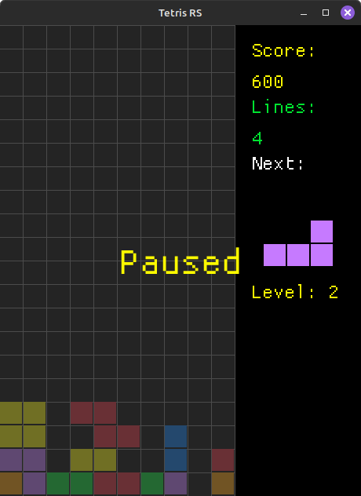

# 🎮 Tetris in Rust with Macroquad

Welcome to **Tetris**, a classic puzzle game brought to life with the power of [Rust](https://www.rust-lang.org/) and [macroquad](https://github.com/not-fl3/macroquad)! This project is a fun, modern, and hackable implementation of Tetris, designed for learning, playing, and extending.

---

## 🚀 Features

- **Smooth Graphics:** Powered by macroquad for fast, cross-platform rendering.
- **Async Game Loop:** Responsive controls and silky-smooth gameplay.
- **Customizable:** Tweak, extend, or theme the game as you like.
- **Minimal Dependencies:** Lightning-fast builds and easy to understand codebase.

---

## 🕹️ Controls

| Key         | Action         |
|-------------|----------------|
| ← / →       | Move left/right (hold for continuous movement) |
| ↓           | Soft drop (hold for faster descent)            |
| ↑ / X       | Rotate (with wall kick near borders)           |
| Space       | Hard drop                                      |
| P           | Pause                                          |
| Q / Esc     | Quit                                           |

---

## 🛠️ Getting Started

### 1. Prerequisites

- [Rust](https://rustup.rs/) (edition 2024 or newer recommended)

### 2. Build & Run

```sh
cargo run
```

The game window will pop up. Have fun!

---

## 📦 Dependencies

- [macroquad](https://crates.io/crates/macroquad) — for graphics, input, and game loop

---

## 🧩 Project Structure

```
tetris/
├── src/
│   ├── main.rs        # Game entry point and main loop
│   ├── parameters.rs  # Movement/configuration parameters and grouped timers
│   ├── game/          # Game logic (collision, stacking, etc.)
│   ├── grid.rs        # Grid drawing and logic
│   ├── score/         # Score handling
│   ├── state.rs       # Game state management
│   ├── tetromino/     # Tetromino shapes, rotation, and drawing
│   └── ui/            # UI drawing helpers
├── Cargo.toml         # Rust dependencies
└── README.md          # This file!
```

---

## ✨ Screenshots



---

## 🆕 Recent Improvements

- **Wall Kick Rotation:** Tetrominoes can now rotate near the left/right borders using wall kick logic, preventing overlap with grid boundaries.
- **Soft Drop in All Directions:** Holding left, right, or down moves the tetromino smoothly and continuously, with configurable repeat rates.
- **Configurable Parameters:** All movement speeds and related settings are now in `src/parameters.rs` for easy tuning.
- **Grouped Timers:** Movement timers are grouped in a `Timers` struct for cleaner code and easier management.
- **Cleaner Main Loop:** The main game loop is now more readable, with logic and configuration separated into modules.


---

## 📜 License

MIT License. See [LICENSE](LICENSE) for details.

---

## 💡 Credits

- [macroquad](https://github.com/not-fl3/macroquad) by @not-fl3
- Inspired by the original Tetris game by Alexey Pajitnov

---

Enjoy the game!
Made with ❤️ and Rust.
